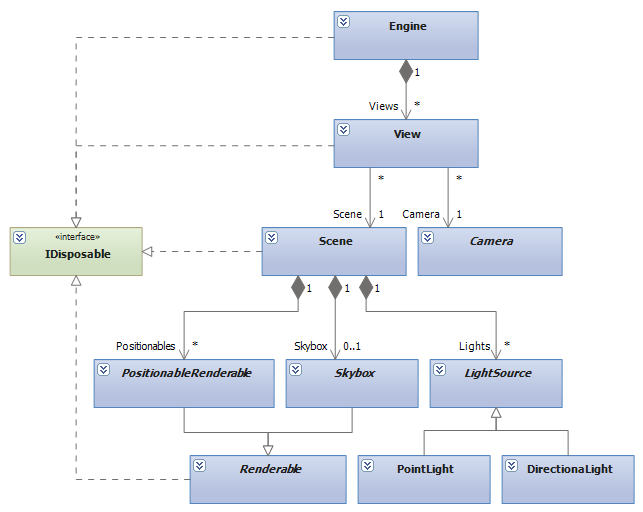

The engine manages the visible world it renders via [Views](View), which are a combination of a [Camera](Camera) and a Scene, which in turn contain multiple [Renderables](Renderable).

See also: [Dispose](Dispose)

