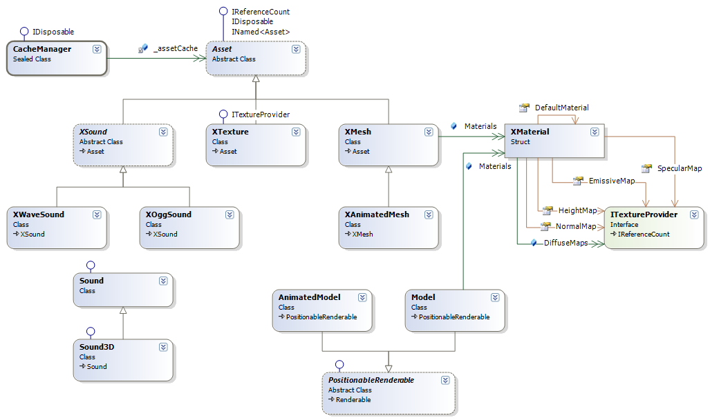

# Overview

An asset is a content file loaded by the engine at runtime. This includes textures, models, sounds, etc.. These files are located using a [Virtual File System](vfs.md).

Asset files are often referenced many times during an application's runtime. To prevent repeated load delays the engine keeps loaded and parsed content in an in-memory cache that can be flushed, e.g. after switching maps.

