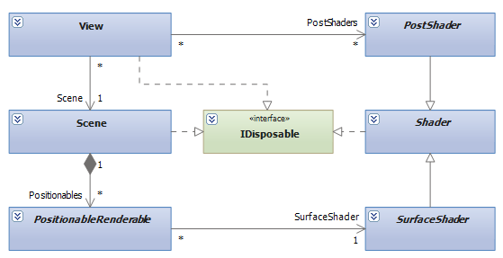
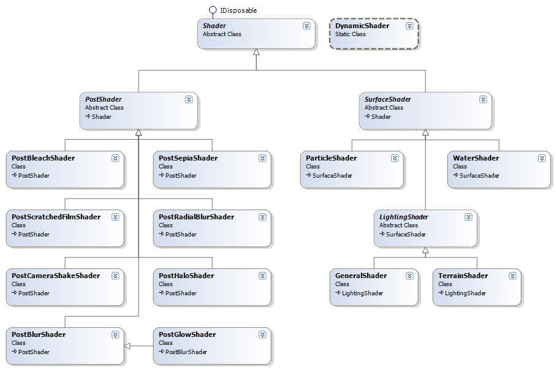

title: Overview

Shaders are small pieces of code executed directly on the graphics card. They govern how vertexes are transformed and how each individual pixel color is calculated.

The engine stores shaders in the High Level Shader Format (HLSL) and supports the [Standard Annotations and Semantics](sas.md). It can dynamically generate shaders at runtime and apply pixel shaders to the entire scene.

The HLSL code is stored in `.fx` files in the `Shader` subdirectory of the Engine's source directory. They are compiled to `.fxo` files via a post-build script. Each HLSL file usually has a corresponding C# class in the `OmegaEngine.Graphics.Shaders` namespace.

